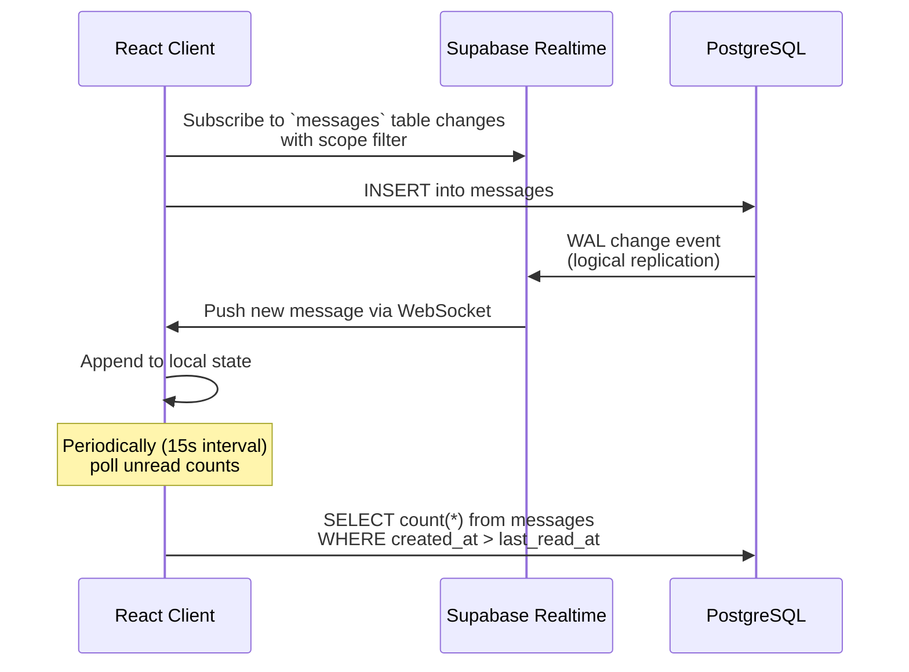

# Agency Management App

A **multi-tenant B2B SaaS application** for agency/project management with real-time collaboration, dynamic role-based access control, project tracking, and organization-wide chat. Built with **React 19 + TypeScript (frontend)**, **Express.js (backend)**, and **Supabase** (auth, database, realtime, storage).

---

## Table of Contents

1. [Architecture Overview](#1-architecture-overview)
2. [Tech Stack](#2-tech-stack)
3. [Project Structure](#3-project-structure)
4. [Database Schema](#4-database-schema)
5. [Multi-Tenancy (Organizations)](#5-multi-tenancy-organizations)
6. [Authentication & Onboarding](#6-authentication--onboarding)
7. [Role-Based Access Control (RBAC)](#7-role-based-access-control-rbac)
8. [Project Management](#8-project-management)
9. [Real-Time Chat System](#9-real-time-chat-system)
10. [Backend API](#10-backend-api)
11. [Frontend Architecture](#11-frontend-architecture)
12. [Development Phases (Roadmap)](#12-development-phases-roadmap)
13. [Security & Data Isolation](#13-security--data-isolation)
14. [Environment Variables](#14-environment-variables)
15. [How to Run](#15-how-to-run)

---

## 1. Architecture Overview

```
┌─────────────────────────────────────────────────────┐
│                   Frontend (React 19)                │
│  ┌──────────┐ ┌──────────┐ ┌──────────────────────┐ │
│  │ Auth UI  │ │ Chat UI  │ │ Project Dashboard    │ │
│  └──────────┘ └──────────┘ └──────────────────────┘ │
│  ┌──────────────────────────────────────────────────┐│
│  │   Service Layer (Supabase Client-Side Queries)  ││
│  └──────────────────────────────────────────────────┘│
└──────────────────────┬──────────────────────────────┘
                       │ HTTPS / WebSocket
                       ▼
┌─────────────────────────────────────────────────────┐
│               Supabase (Backend-as-a-Service)        │
│  ┌──────────┐ ┌──────────┐ ┌──────────────────────┐ │
│  │ Auth     │ │PostgreSQL│ │ Realtime (WebSocket) │ │
│  │(JWT)     │ │+ RLS     │ │ Pub/Sub              │ │
│  └──────────┘ └──────────┘ └──────────────────────┘ │
│  ┌──────────┐ ┌────────────────────────────────────┐│
│  │ Storage  │ │ Auto-Org Trigger (handle_new_user) ││
│  └──────────┘ └────────────────────────────────────┘│
└──────────┬──────────────────────────────────────────┘
           │
           ▼
┌─────────────────────────────────────────────────────┐
│         Express.js Backend Server (Optional)         │
│  ┌─────────────────────────────────────────────────┐│
│  │  Auth Middleware → Health Check → User Profile  ││
│  │  Service layer placeholder (webhooks, email,    ││
│  │  audit logs, file processing, integrations)     ││
│  └─────────────────────────────────────────────────┘│
└─────────────────────────────────────────────────────┘
```

**Key architectural decisions:**
- **Supabase-first approach**: Most business logic runs client-side via Supabase JS SDK with Row-Level Security (RLS) enforcing multi-tenant isolation.
- **Express backend** is used for server-only concerns: webhook processing, email notifications, audit log aggregation, file processing, and external API integrations.
- **Real-time messaging** uses Supabase Realtime (PostgreSQL logical replication → WebSocket push).
- **Multi-tenancy** is enforced at the database level via `organization_id` foreign keys and RLS policies.

---

## 2. Tech Stack

| Layer | Technology | Version |
|---|---|---|
| **Frontend Framework** | React | ^19.0.0 |
| **Language** | TypeScript | ^5.7.2 |
| **Bundler** | Vite | ^6.0.1 |
| **Routing** | react-router-dom | ^7.18.1 |
| **HTTP Client** | Axios | ^1.18.1 |
| **Backend Runtime** | Node.js (Express) | ^4.21.2 |
| **Database** | PostgreSQL (via Supabase) | - |
| **Auth** | Supabase Auth (JWT) | - |
| **Realtime** | Supabase Realtime (WebSocket) | - |
| **Backend Language** | TypeScript | ^5.7.2 |
| **Supabase JS SDK** | @supabase/supabase-js | ^2.48.1 |

---

## 3. Project Structure

```
agency_management_app/
├── .gitignore
├── PROJECT_IDEA.md                 # Original concept document
├── DEVELOPMENT_PLAN.md             # Development roadmap
├── README.md                       # ← You are here
│
├── backend/                        # Express.js server
│   ├── package.json
│   ├── tsconfig.json
│   └── src/
│       ├── index.ts                # Express app entry (routes, middleware)
│       ├── config/
│       │   └── supabase.ts         # Supabase admin client (service_role key)
│       ├── controllers/
│       │   └── health.ts           # GET /health, GET /api/users/me
│       ├── middleware/
│       │   ├── auth.ts             # JWT verification middleware
│       │   └── errorHandler.ts     # Global error handler
│       ├── models/
│       │   └── index.ts            # TS interfaces: Organization, Profile, Project
│       └── services/
│           └── index.ts            # Service layer placeholder (webhooks, email, etc.)
│
├── frontend/                       # React SPA
│   ├── index.html                  # Entry point
│   ├── package.json
│   ├── tsconfig.json
│   ├── vite.config.ts              # Vite + React plugin
│   └── src/
│       ├── main.tsx                # React root (BrowserRouter)
│       ├── App.tsx                 # Root component with routing
│       ├── vite-env.d.ts           # Vite client type declarations
│       ├── api/
│       │   └── supabaseClient.ts   # Supabase anon key client (public)
│       ├── services/               # Data access layer (all CRUD goes through these)
│       │   ├── ProjectService.ts       # Project CRUD
│       │   ├── TaskService.ts          # Task CRUD
│       │   ├── MilestoneService.ts     # Milestone CRUD
│       │   ├── ProjectMemberService.ts # Project membership management
│       │   ├── ChannelService.ts       # Chat channel CRUD + membership
│       │   ├── ConversationService.ts  # DM conversations + user search
│       │   └── ChatService.ts          # Messages, read receipts, unread counts
│       ├── components/
│       │   ├── Auth.tsx               # Signup/Login forms
│       │   ├── ErrorBoundary.tsx      # React error boundary
│       │   ├── ProjectDashboard.tsx   # Project list + CRUD + task/milestone toggles
│       │   ├── TaskList.tsx           # Task list within a project + embedded ChatBox
│       │   ├── MilestoneList.tsx      # Milestone list within a project
│       │   ├── ChatBox.tsx           # Real-time message component (channel/DM/project)
│       │   └── ChatLayout.tsx        # Full chat UI: sidebar + main area
│       └── pages/
│           ├── ProjectsPage.tsx      # Wrapper → ProjectDashboard
│           └── ChatPage.tsx          # Wrapper → ChatLayout
│
└── database/                        # SQL migration scripts
    ├── schema.sql                   # Core schema: orgs, profiles, projects, tasks, milestones, project_members + RLS + auto-org trigger
    └── chat_schema.sql             # Chat schema: channels, conversations, messages, read receipts + RLS + realtime publication
```

---

## 4. Database Schema

### 4.1 Core Tables (schema.sql)

```mermaid
erDiagram
    organizations {
        uuid id PK
        text name
        text domain UK
        timestamptz created_at
    }
    profiles {
        uuid id PK FK "→ auth.users"
        uuid organization_id FK "→ organizations"
        text email
        text role "default: 'employee'"
        timestamptz created_at
    }
    projects {
        uuid id PK
        uuid organization_id FK "→ organizations"
        text name
        text description
        timestamptz created_at
    }
    tasks {
        uuid id PK
        uuid project_id FK "→ projects"
        uuid organization_id FK "→ organizations"
        text title
        text status "default: 'pending'"
        timestamptz created_at
    }
    milestones {
        uuid id PK
        uuid project_id FK "→ projects"
        uuid organization_id FK "→ organizations"
        text name
        text description
        date due_date
        text status "default: 'pending'"
        timestamptz created_at
    }
    project_members {
        uuid id PK
        uuid project_id FK "→ projects"
        uuid user_id FK "→ profiles"
        uuid organization_id FK "→ organizations"
        text role "default: 'member'"
        timestamptz joined_at
        constraint "UNIQUE(project_id, user_id)"
    }
    organizations ||--o{ profiles : "has"
    organizations ||--o{ projects : "owns"
    organizations ||--o{ tasks : "scopes"
    organizations ||--o{ milestones : "scopes"
    organizations ||--o{ project_members : "scopes"
    projects ||--o{ tasks : "contains"
    projects ||--o{ milestones : "contains"
    projects ||--o{ project_members : "has members"
    profiles ||--o{ project_members : "member of"
```

### 4.2 Chat Tables (chat_schema.sql)

```mermaid
erDiagram
    channels {
        uuid id PK
        uuid organization_id FK
        text name "UNIQUE per org"
        text description
        uuid created_by FK "→ profiles"
        boolean is_private "default: false"
        timestamptz created_at
    }
    channel_members {
        uuid id PK
        uuid channel_id FK
        uuid user_id FK
        uuid organization_id FK
        text role "default: 'member'"
        timestamptz joined_at
        constraint "UNIQUE(channel_id, user_id)"
    }
    conversations {
        uuid id PK
        uuid organization_id FK
        timestamptz created_at
    }
    conversation_participants {
        uuid id PK
        uuid conversation_id FK
        uuid user_id FK
        uuid organization_id FK
        timestamptz joined_at
        constraint "UNIQUE(conversation_id, user_id)"
    }
    messages {
        uuid id PK
        uuid organization_id FK
        uuid project_id FK "nullable"
        uuid channel_id FK "nullable"
        uuid conversation_id FK "nullable"
        uuid sender_id FK "→ profiles"
        text content
        timestamptz created_at
    }
    message_reads {
        uuid id PK
        uuid user_id FK
        uuid organization_id FK
        uuid project_id FK "nullable"
        uuid channel_id FK "nullable"
        uuid conversation_id FK "nullable"
        timestamptz last_read_at
    }
    organizations ||--o{ channels : "has"
    organizations ||--o{ conversations : "has"
    organizations ||--o{ messages : "scopes"
    organizations ||--o{ message_reads : "scopes"
    channels ||--o{ channel_members : "has members"
    channels ||--o{ messages : "scope"
    conversations ||--o{ conversation_participants : "has participants"
    conversations ||--o{ messages : "scope"
    projects ||--o{ messages : "scope"
    profiles ||--o{ messages : "sent by"
    profiles ||--o{ message_reads : "read by"
```

### 4.3 Key Design Decisions

- **`organization_id` on every table**: Every single data table has an `organization_id` foreign key. This is the foundation of multi-tenancy.
- **`messages` table is multi-scope**: A single `messages` table handles all three chat contexts — channels (via `channel_id`), project chats (via `project_id`), and DMs (via `conversation_id`). Exactly one of these three columns is non-null (or all null for global chat).
- **`message_reads` uses partial unique indexes**: Instead of a single compound unique constraint, four separate filtered unique indexes (`message_reads_global_unique`, `message_reads_project_unique`, `message_reads_channel_unique`, `message_reads_conversation_unique`) ensure one read-receipt row per user per scope.
- **Auto-org creation trigger**: A PostgreSQL trigger function `handle_new_user()` fires on `AFTER INSERT ON auth.users` to automatically create an organization, profile, and #general channel.
- **Supabase Realtime**: The `messages` table is added to the `supabase_realtime` publication so changes are pushed to connected clients via WebSocket.

---

## 5. Multi-Tenancy (Organizations)

### 5.1 Concept

Everything in the app is scoped to an **Organization**. An organization represents a company, team, or client. Each user belongs to exactly one organization. Data is completely isolated between organizations.

### 5.2 Auto-Provisioning

When a new user signs up, the database trigger `handle_new_user()` automatically:
1. Creates a new `organizations` row
2. Creates a corresponding `profiles` row with `role: 'admin'`
3. Creates a `#general` channel for the organization
4. Adds the user as a member of `#general` with `role: 'admin'`

### 5.3 Data Isolation Pattern

All database queries include `organization_id` filtering. The pattern is enforced at **two levels**:
1. **Supabase RLS policies**: Every table has RLS policies that filter by `organization_id = (SELECT organization_id FROM profiles WHERE id = auth.uid())`.
2. **Application code**: Frontend service classes explicitly inject `organization_id` when inserting records.

### 5.4 RLS Policy Template

Every table follows this exact RLS pattern:
```sql
CREATE POLICY "Users can [action] [resource] in their org" ON [table]
  FOR [SELECT|INSERT|UPDATE|DELETE]
  USING (
    organization_id = (SELECT organization_id FROM profiles WHERE id = auth.uid())
  );
```

Special cases:
- **channels**: Private channels additionally check membership in `channel_members`.
- **messages**: Must be member of the channel/project/conversation to see messages.
- **conversations**: Only participants can see a conversation.
- **message_reads**: Each user can only see their own read receipts.

---

## 6. Authentication & Onboarding

### 6.1 Flow

```
User visits app → [Not logged in] → Auth component shown
                                    ├── Sign Up: email + password + org name
                                    └── Log In: email + password
                                           │
                                    Supabase Auth (JWT issued)
                                           │
                                    Database trigger creates:
                                      ├── Organization
                                      ├── Profile (role: admin)
                                      └── #general channel
                                           │
                                    Session stored → App renders
```

### 6.2 Implementation

- **Supabase Auth** handles all authentication (email/password).
- The **Auth.tsx** component has separate signup and login forms.
- On signup, the user's `organization_name` is passed via `options.data` metadata, which the database trigger uses to name the new organization.
- The session is managed via `useState` in `App.tsx`, subscribing to Supabase auth state changes.
- When signed out, the Auth component is shown; when signed in, the main app renders with navigation.

### 6.3 Password Reset

Password reset uses Supabase's built-in email magic link flow (not yet wired in the UI but available via the API).

---

## 7. Role-Based Access Control (RBAC)

### 7.1 Current Implementation

Currently, roles are **simplified** — the `profiles.role` column stores a string (default: `'employee'`, first user gets `'admin'`). There is no granular permission matrix yet.

### 7.2 Planned (Phase 4)

The full RBAC system (as described in PROJECT_IDEA.md) will include:
- **Unlimited custom roles** defined by the Organization Administrator.
- **Granular Permission Matrix**: Each role has permissions for Projects (C/R/U/D, assign users, manage milestones), Users (view, add, edit, delete, manage roles), Settings, Chat, and Reports.
- **Role Management UI**: Settings → Roles & Permissions page.
- **Permission Guard**: A middleware/hook (`usePermission`) to check access.
- **Default roles**: Administrator, CEO, COO, HR, PM, HOD (Head of Department), Employee.

### 7.3 Current Role Usage

- The `role` field in `profiles` is stored but not yet used for permission checking beyond auto-assigning `'admin'` to org creators.
- The `channel_members.role` tracks membership role in a channel.
- The `project_members.role` tracks membership role in a project.

---

## 8. Project Management

### 8.1 Features

| Feature | Status | Implementation |
|---|---|---|
| Create project | ✅ Done | `ProjectService.createProject()` |
| View projects | ✅ Done | `ProjectService.getProjects()` |
| Update project | ✅ Done | `ProjectService.updateProject()` |
| Delete project | ✅ Done | `ProjectService.deleteProject()` |
| Create tasks | ✅ Done | `TaskService.createTask()` |
| View tasks | ✅ Done | `TaskService.getTasks()` |
| Update task status | ✅ Done | `TaskService.updateTask()` |
| Delete task | ✅ Done | `TaskService.deleteTask()` |
| Create milestones | ✅ Done | `MilestoneService.createMilestone()` |
| View milestones | ✅ Done | `MilestoneService.getMilestones()` |
| Update milestone status | ✅ Done | `MilestoneService.updateMilestone()` |
| Delete milestone | ✅ Done | `MilestoneService.deleteMilestone()` |
| Project members | ✅ Done | `ProjectMemberService` |
| Auto-add creator as member | ✅ Done | In `ProjectService.createProject()` |
| Per-project chat | ✅ Done | Embedded `ChatBox` in `TaskList` |
| Unread indicators | ✅ Done | `ChatService.getUnreadCount()` |

### 8.2 Component Hierarchy

```
ProjectDashboard
├── Create Project Form
├── Project List
│   └── For each project:
│       ├── Edit/Delete buttons
│       ├── View Tasks button → TaskList
│       │   ├── Create Task Form
│       │   ├── Task List (with status management)
│       │   └── ChatBox (project-specific chat)
│       └── View Milestones button → MilestoneList
│           ├── Create Milestone Form
│           └── Milestone List (with status management)
```

### 8.3 Project Membership Flow

When a user creates a project, they are automatically added as a `project_members` entry with `role: 'owner'`. Other users can be added/removed via `ProjectMemberService.addMember()` / `removeMember()`.

---

## 9. Real-Time Chat System

### 9.1 Chat Scopes

The chat system supports **three types** of conversations, all using the same `messages` table:

| Scope | Description | Auto-Created | Access Control |
|---|---|---|---|
| **Channel** | Organization-wide channels (#general, #announcements, etc.) | #general created on org creation | Public: all members can join. Private: invited members only |
| **Direct Message (DM)** | 1-on-1 private conversations | On first message between two users | Only the two participants |
| **Project Chat** | Contextual chat within a project | N/A (any member can message) | Only project members |

Plus **Global Chat** (all scope columns null) — reserved for org-wide announcements.

### 9.2 Chat UI

**ChatLayout** provides a Slack-like interface:
```
┌─────────────────────────────────────────────────────────┐
│  Sidebar (240px)              │  Main Chat Area          │
│                              │                          │
│  CHANNELS                    │  ChatBox Component        │
│  ├── # general               │  ┌──────────────────────┐│
│  ├── # announcements         │  │ Header: channel/DM/  ││
│  └── + Create Channel        │  │ project name         ││
│ ───────────────────────      │  ├──────────────────────┤│
│  DIRECT MESSAGES              │  │ Message List         ││
│  ├── + New DM                │  │ (real-time updates)  ││
│  ├── @alex                   │  │                      ││
│  └── @jordan                 │  ├──────────────────────┤│
│ ───────────────────────      │  │ Message Input        ││
│  PROJECTS                    │  └──────────────────────┘│
│  ├── Website Redesign        │                          │
│  ├── Mobile App              │                          │
│  └── Marketing Campaign      │                          │
└─────────────────────────────────────────────────────────┘
```

### 9.3 Real-Time Architecture



### 9.4 Chat Components

| Component | File | Purpose |
|---|---|---|
| `ChatLayout` | `ChatLayout.tsx` | Sidebar + main area layout. Manages active chat state, lists channels/DMs/projects with unread badges. |
| `ChatBox` | `ChatBox.tsx` | Core chat component. Fetches messages, listens to realtime inserts, marks messages as read, sends messages. |
| `ChannelService` | `ChannelService.ts` | Channel CRUD, membership management, join/leave. |
| `ConversationService` | `ConversationService.ts` | DM conversation creation, participant lookup, user search by email. |
| `ChatService` | `ChatService.ts` | Message CRUD, read receipts, unread count calculation, sender display name resolution. |

### 9.5 Unread Indicators

- Unread counts are computed by counting messages newer than the user's `last_read_at` for each scope, excluding the user's own messages.
- Counts are fetched every **15 seconds** via polling.
- Counts are cleared when the user selects the scope.
- Visual badges appear as red circles with the count (capped at `99+`).

---

## 10. Backend API

### 10.1 Endpoints

| Method | Path | Auth | Description |
|---|---|---|---|
| `GET` | `/health` | Public | Health check + Supabase connectivity test |
| `GET` | `/api/users/me` | Bearer JWT | Returns current user's profile |

### 10.2 Middleware

| Middleware | File | Description |
|---|---|---|
| `cors()` | `index.ts` | CORS enabled for all origins |
| `express.json()` | `index.ts` | JSON body parser |
| `authenticateUser` | `auth.ts` | Verifies JWT from `Authorization: Bearer <token>` header. Attaches `req.user` with `id`, `email`, `role`. |
| `errorHandler` | `errorHandler.ts` | Global error handler. Returns JSON `{ error: string }` with appropriate status code. In development, includes stack trace. |

### 10.3 Models (TypeScript Interfaces)

```typescript
interface Organization {
  id: string;           // UUID
  name: string;
  domain: string | null;
  created_at: string;
}

interface Profile {
  id: string;           // References auth.users.id
  organization_id: string;
  email: string | null;
  role: string;
  created_at: string;
}

interface Project {
  id: string;
  organization_id: string;
  name: string;
  description: string | null;
  created_at: string;
}
```

### 10.4 Supabase Clients

Two Supabase clients exist:

| Client | File | Key Used | Purpose |
|---|---|---|---|
| `supabase` (frontend) | `frontend/src/api/supabaseClient.ts` | **Anon key** (`VITE_SUPABASE_ANON_KEY`) | Client-side operations through RLS |
| `supabaseAdmin` (backend) | `backend/src/config/supabase.ts` | **Service role key** (`SUPABASE_SERVICE_ROLE_KEY`) | Server-side admin operations bypassing RLS |

### 10.5 Service Layer (Backend)

The backend `services/index.ts` is a **placeholder** for future server-only business logic:

- Stripe/Stripe webhook processing
- SendGrid email notifications
- Audit log aggregation
- File processing (image resizing, PDF generation)
- External API integrations

---

## 11. Frontend Architecture

### 11.1 Component Tree

```
<App>
├── [Not logged in] → <Auth>
│   ├── Sign Up form (email, password, org name)
│   └── Log In form (email, password)
│
└── [Logged in] → Main App
    ├── Navigation (Projects | Chat | Logout)
    └── <ErrorBoundary>
        └── <Routes>
            ├── /projects → <ProjectsPage> → <ProjectDashboard>
            └── /chat → <ChatPage> → <ChatLayout> → <ChatBox>
```

### 11.2 Service Layer Pattern

All data access goes through service classes. Each service:
1. Gets the current user via `supabase.auth.getUser()`.
2. Gets the user's `organization_id` from `profiles`.
3. Performs the database operation with explicit `organization_id` scoping.
4. Returns typed data.

This pattern ensures **data isolation** even if RLS policies were somehow bypassed.

### 11.3 Routing

| Route | Component | Description |
|---|---|---|
| `/projects` | `ProjectsPage` → `ProjectDashboard` | Project management dashboard |
| `/chat` | `ChatPage` → `ChatLayout` | Real-time chat interface |
| `*` | Redirect to `/projects` | Default route |

### 11.4 Error Handling

- **`ErrorBoundary`** class component wraps all routes. Catches render errors and shows a fallback UI with a "Reload page" button.
- Auth errors are surfaced inline in the `App` component.
- Service errors are caught with try/catch and logged to console; user-facing errors use `alert()` for critical operations.
- The backend has a centralized `errorHandler` middleware returning JSON errors.

---

## 12. Development Phases (Roadmap)

> **Current Status**: Phase 1-3 mostly complete. Phase 4 (Dynamic RBAC) and Phase 5 (Dashboards, Polish) planned.

### ⬜ Phase 1: Foundation & Authentication (Multi-Tenancy Base)
- [x] Supabase Auth setup (email/password)
- [x] Signup/Login page
- [x] Auto org creation on signup (database trigger)
- [x] RLS policies on all tables

### ⬜ Phase 2: Project Management (Core Workflow)
- [x] Project CRUD (create, read, update, delete)
- [x] Organization-scoped queries
- [x] Project dashboard with grid/list
- [x] Milestones & Tasks (CRUD + status management)
- [x] Project membership management

### ⬜ Phase 3: Real-Time Collaboration (Chat)
- [x] Supabase Realtime enabled on `messages` table
- [x] Global chat (#general channels)
- [x] Direct messages (create/find conversations)
- [x] Project-specific chat threads
- [x] Unread indicators (read receipts + polling)

### ⬜ Phase 4: Dynamic RBAC (Roles & Permissions)
- [ ] Expand permission schema (granular permission matrix)
- [ ] Build `usePermission` guard hook
- [ ] Role management UI in Settings

### ⬜ Phase 5: Polish & Advanced Features
- [ ] Role-based dashboards
- [ ] Full-text search (PostgreSQL `tsvector`)
- [ ] File uploads (Supabase Storage)
- [ ] Audit logging
- [ ] Chat notification settings
- [ ] Integrations & billing

---

## 13. Security & Data Isolation

### 13.1 Multi-Tenant Isolation

| Layer | Mechanism |
|---|---|
| **Database** | Every table has `organization_id` FK. RLS policies filter on it. |
| **Application** | Service layer explicitly includes `organization_id` in all queries. |
| **Auth** | JWT tokens tied to specific user; cannot access other orgs' data. |
| **Row-Level Security** | 50+ RLS policies enforce org-level isolation at the database level. |

### 13.2 RLS Coverage

| Table | SELECT | INSERT | UPDATE | DELETE |
|---|---|---|---|---|
| organizations | ✅ Own org | - | ✅ Own org | ✅ Own org |
| profiles | ✅ Same org | ✅ Own profile | ✅ Same org | ✅ Same org |
| projects | ✅ Same org | ✅ Same org | ✅ Same org | ✅ Same org |
| tasks | ✅ Same org | ✅ Same org | ✅ Same org | ✅ Same org |
| milestones | ✅ Same org | ✅ Same org | ✅ Same org | ✅ Same org |
| project_members | ✅ Same org | ✅ Same org | ✅ Same org | ✅ Same org |
| channels | ✅ Same org (public) / membership (private) | ✅ Same org | ✅ Same org | ✅ Same org |
| channel_members | ✅ Same org | ✅ Same org | ✅ Same org | ✅ Same org |
| conversations | ✅ Participant only | ✅ Same org | - | - |
| conversation_participants | ✅ Participant only | ✅ Same org | - | - |
| messages | ✅ Same org + scope membership | ✅ Same org + scope membership | ✅ Own messages | ✅ Own messages |
| message_reads | ✅ Own reads only | ✅ Own reads only | ✅ Own reads only | - |

### 13.3 Chat-Specific Security

- Channel visibility respects privacy: public channels are visible to all org members; private channels only to members.
- Messages can only be inserted into scopes the user is a member of (channel membership, project membership, conversation participant).
- Users can only update/delete their own messages.
- Read receipts are scoped per user.

---

## 14. Environment Variables

### 14.1 Frontend (`frontend/.env`)

```env
VITE_SUPABASE_URL=https://your-project.supabase.co
VITE_SUPABASE_ANON_KEY=your-supabase-anon-key
```

### 14.2 Backend (`backend/.env`)

```env
SUPABASE_URL=https://your-project.supabase.co
SUPABASE_SERVICE_ROLE_KEY=your-service-role-key
PORT=3001
NODE_ENV=development
```

---

## 15. How to Run

### 15.1 Prerequisites

- Node.js >= 18
- A Supabase project (free tier works) with:
  - Auth: Email/Password provider enabled
  - Database: Run `database/schema.sql` and `database/chat_schema.sql` in the SQL Editor
  - Realtime: Enabled on the `messages` table (done automatically by `chat_schema.sql`)

### 15.2 Setup

```bash
# 1. Clone the repository
git clone <repo-url>
cd agency_management_app

# 2. Install dependencies
cd frontend && npm install
cd ../backend && npm install

# 3. Set up environment variables
cp frontend/.env.example frontend/.env    # Edit with your Supabase credentials
cp backend/.env.example backend/.env       # Edit with your Supabase credentials

# 4. Run database migrations
# Execute schema.sql and chat_schema.sql in Supabase SQL Editor

# 5. Start the backend
cd backend
npm run dev
# Server runs on http://localhost:3001

# 6. Start the frontend (in a separate terminal)
cd frontend
npm run dev
# App runs on http://localhost:5173
```

### 15.3 Database Setup

Open your Supabase project's SQL Editor and run the scripts in this order:
1. `database/schema.sql` — Core tables, RLS, and auto-org trigger
2. `database/chat_schema.sql` — Chat tables, RLS, and realtime publication

### 15.4 Testing Multi-Tenancy

1. Sign up with Organization A (email A) → creates Org A
2. Sign up with Organization B (email B) → creates Org B
3. Create projects in Org A — they should NOT be visible when logged in as Org B
4. Verify RLS by attempting direct Supabase queries from different sessions

---

## Frontend Service Reference

### `ProjectService`
| Method | Parameters | Description |
|---|---|---|
| `getProjects()` | - | Returns all projects in user's org |
| `createProject(name, description)` | string, string | Creates project + auto-adds creator as member |
| `updateProject(id, fields)` | string, object | Updates name/description |
| `deleteProject(id)` | string | Deletes project |

### `TaskService`
| Method | Parameters | Description |
|---|---|---|
| `getTasks(projectId)` | string | Returns all tasks for a project |
| `createTask(projectId, title)` | string, string | Creates task in project |
| `updateTask(id, fields)` | string, object | Updates title/status |
| `deleteTask(id)` | string | Deletes task |

### `MilestoneService`
| Method | Parameters | Description |
|---|---|---|
| `getMilestones(projectId)` | string | Returns all milestones |
| `createMilestone(projectId, name, description, dueDate)` | string, string, string, string | Creates milestone |
| `updateMilestone(id, fields)` | string, object | Updates fields |
| `deleteMilestone(id)` | string | Deletes milestone |

### `ProjectMemberService`
| Method | Parameters | Description |
|---|---|---|
| `getUserProjects()` | - | Returns projects the current user is a member of |
| `isMember(projectId)` | string | Checks membership |
| `addMember(projectId, userId, role?)` | string, string, string | Adds user to project |
| `removeMember(projectId, userId)` | string, string | Removes user |
| `getMembers(projectId)` | string | Lists project members |

### `ChannelService`
| Method | Parameters | Description |
|---|---|---|
| `getChannels()` | - | Returns all visible channels |
| `getChannelsWithMembership()` | - | Channels + `is_member` flag |
| `createChannel(name, description, isPrivate)` | string, string, boolean | Creates + auto-joins creator |
| `addMember(channelId, userId, role?)` | string, string, string | Adds user to channel |
| `removeMember(channelId, userId)` | string, string | Removes user |
| `isMember(channelId)` | string | Checks membership |
| `getMembers(channelId)` | string | Lists members |
| `joinChannel(channelId)` | string | Auto-joins public channel |

### `ConversationService`
| Method | Parameters | Description |
|---|---|---|
| `getConversations()` | - | Returns user's DMs with other participant info |
| `createOrGetConversation(otherUserId)` | string | Finds existing or creates new DM |
| `searchUsers(query)` | string | Searches org users by email prefix |

### `ChatService`
| Method | Parameters | Description |
|---|---|---|
| `getMessages(projectId?, channelId?, conversationId?)` | string\|null | Fetches messages for a scope |
| `sendMessage(projectId?, content, channelId?, conversationId?)` | string\|null, string, string\|null, string\|null | Sends a message |
| `markAsRead(projectId?, channelId?, conversationId?)` | string\|null | Upserts read receipt |
| `getUnreadCount(projectId?, channelId?, conversationId?)` | string\|null | Counts unread messages |
| `getAllUnreadCounts()` | - | Returns all unread counts for projects |
| `getSenderDisplayName(userId)` | string | Resolves display name |